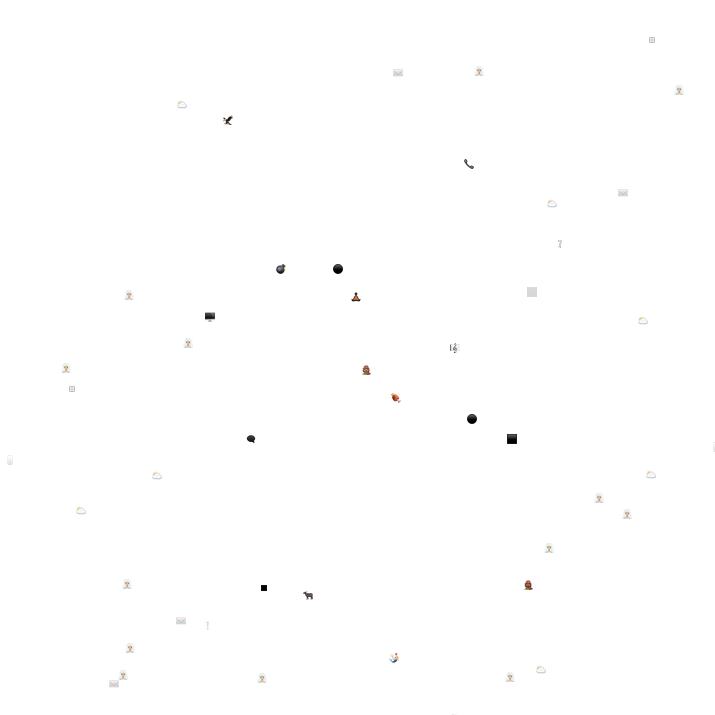
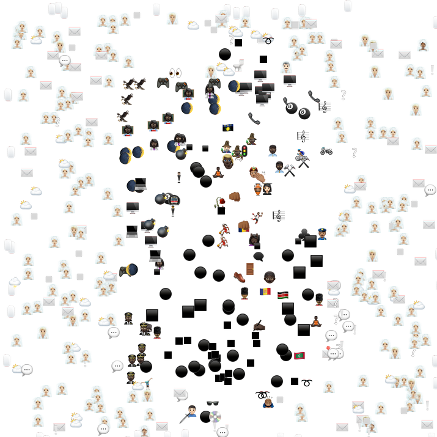
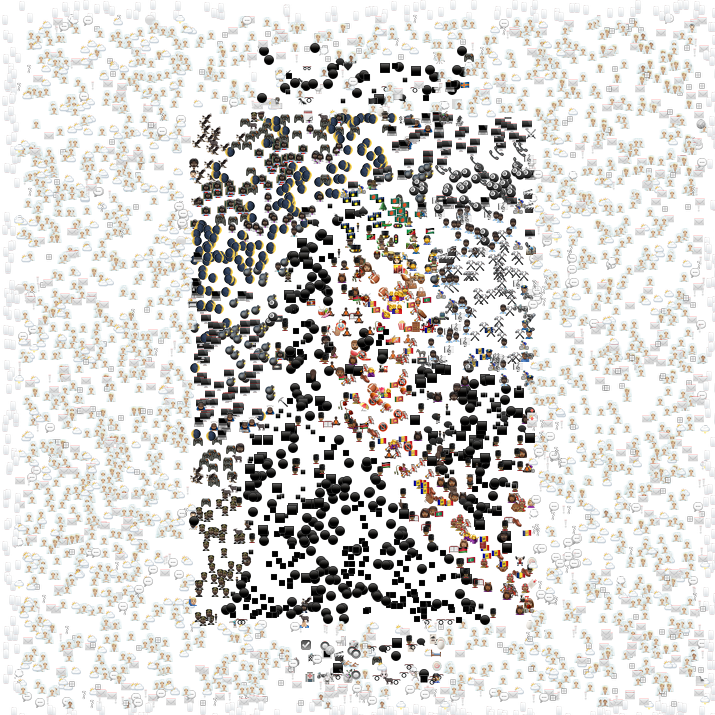
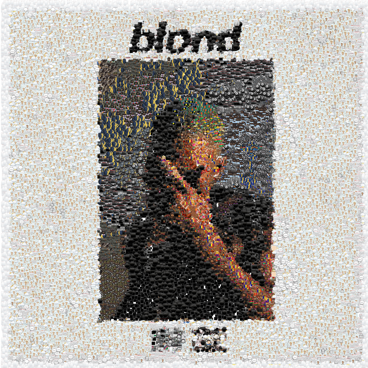

# emvision
ge·stalt /ɡəˈSHtält/: an organized whole that is perceived as more than the sum of its parts.

### Overview
emvision is a command line tool written in rust which allows a user to recreate an image by composing many smaller images.  The algorithm runs for some number of `iterations`.  On each iteration, it
1. selects a random pixel from the source image
2. finds the picture with an "average rgb" value closest to the selected pixels rgb value
3. places the found image on a "canvas" in the same location as the selected pixel

To illustrate this, we compare the output of varying iterations:
| number of iterations | output                                                       |
|----------------------|--------------------------------------------------------------|
| 50                   |        |
| 500                  |      |
| 5000                 |    |
| 50000                |  |
| source image         |             |

By varying the number of iterations, we arrive at different results.  However, the number of iterations is only one of many parameters that emvision allows the user to specify.  For a more detailed discussion, see the usage section.

### Installation
emvision is a rust project, and as such the user must first install the rust toolchain on their computer.  Follow the instructions [here](https://www.rust-lang.org/tools/install) to get started.

after rust is installed, clone the repo, build the project, and view usage instructions
```
$ git clone git@github.com:trstruth/emvision.git
$ cd emvision
$ cargo build --release
$ ./target/release/emvision --help
emvision 0.1.0
trstruth
Generates an emoji vision image

USAGE:
    emvision [OPTIONS] <target_path>

FLAGS:
    -h, --help       Prints help information
    -V, --version    Prints version information

OPTIONS:
    -e, --emoji-dir <emoji_dir>
    -z, --image-size <image_size>
    -n, --num-iterations <num_iterations>
    -o, --output <output>
    -s, --scale <scale>

ARGS:
    <target_path>
```

### Usage
The usage for emvision follows the standard cli tool format:

`./target/release/emvision --<option 1 name> <option 1 value> ... --<option n name> <option n value> <target_path>`

For example, to create an image from `foo.png` with 200 iterations and save the output to `bar.png` the following command would be used

`./target/release/emvision --num-iterations 200 --output bar.png foo.png`

One can use the "short" name of the options as well.  The equivalent abbreviation of the above would be

`./target/release/emvision -n 200 -o bar.png foo.png`

### Options
emvision allows the users to specify the following options:
| option                                | effect                                                                                                                                                                                                                                                |
|---------------------------------------|-------------------------------------------------------------------------------------------------------------------------------------------------------------------------------------------------------------------------------------------------------|
| -e, --emoji-dir <emoji_dir>           | A path to a folder containing the subimages to be used when composing the desired image.  Defaults to `emojis`                                                                                                                                        |
| -z, --image-size <image_size>         | The max width/height of the subimages when placed on the canvas.  Sub images will be resized to meet this requirement, and aspect ratio will be maintained.  Defaults to `20`                                                                         |
| -n, --num-iterations <num_iterations> | The number of iterations to run before saving the output image.  More iterations will result in better image quality, but will take longer to execute.  Defaults to `500000`                                                                          |
| -o, --output <output>                 | A path to the output image.  This should always end in ".png".  Defaults to `canvas.png`                                                                                                                                                              |
| -s, --scale <scale>                   | A parameter that controls the scale of the output image to the input image.  For example, if the resolution of the input image is 2000x1000, using a scale value of 2 will result in the output image with the resolution 4000x2000.  Defaults to `1` |
